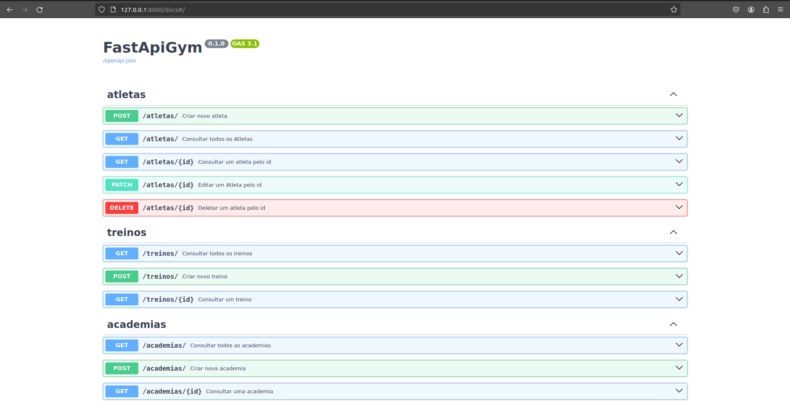

<h1>
    <a href="https://www.dio.me/">
     </a>
    <span> Python AI Backend Developer </span>
</h1>


# :computer: Desafio de projeto: 

## Desenvolvendo sua Primeira API com FastAPI, Python e Docker

### Entendendo o Desafio
 
https://github.com/digitalinnovationone/workout_api 
 
Instruções:
 
- [x] Adicionar query parameters nos endpoints
    - [x] Atleta
        - [x] Nome
        - [x] CPF
- [x] Customizar response de retorno de endpoints
    - [x] Get all
        - [x] Atleta
            - [x] Nome
            - [x] Academia
            - [x] Treinos
- [x] Manipular exceção de integridade dos dados em cada módulo/tabela
    - [x] Tratar sqlalchemy.exc.IntegrityError e devolver a seguinte mensagem: “Já existe um atleta cadastrado com o cpf: x”
    - [x] Definir status_code: 303
- [x] Adicionar paginação utilizando a lib: fastapi-pagination
    - [x] Implementar limit e offset

# :zap:  Tecnologias Utilizadas

- pipenv - controle de versão
- PostgreSQL - banco de dados com docker-compose
- SQLAlchemy + Pydantic + Alembic - conexão com banco de dados
- FastAPI - desenvolver a aplicação

# :bulb: Solução do desafio

O código foi feita seguindo a aula da instrutora.

Para executar o código:

- Instalar requirements.txt
```console
$ pip install -r requirements.txt
```

- Rodar banco de dados na pasta workout_api

```console
$ docker-compose up -d
```

- Rodar alembic na pasta do projeto (local do Makefile)

```console
$ make run-migrations
```

- Rodar app na pasta do projeto

```console
$ make run
```

## Adicionar query parameters nos endpoints

      - atleta
            - nome
            - cpf

Foi adicionado no arquivo atleta/controller.py. É necessário fornecer nome e cpf para a consulta.

```python
@router.get(
    '/',  
    summary='Consultar todos os Atletas',
    status_code=status.HTTP_200_OK,
    response_model=list[AtletaOut],
)
async def query(db_session: DatabaseDependency, nome: str | None = None, cpf: str | None = None) -> list[AtletaOut]:
    atletas: list[AtletaOut] = (await db_session.execute(select(AtletaModel))).scalars().all()
    if nome:
        atletas = [atleta for atleta in atletas if atleta.nome == nome]
    if cpf:
        atletas = [atleta for atleta in atletas if atleta.cpf == cpf]

    return atletas
```

## Customizar response de retorno de endpoints

      - get all
            - atleta
                  - nome
                  - academia
                  - treinos

Foi criado o schema AtletaGetAll personalizado herdando o OutMixin do contrib com id e created_at em atletas/schemas.py 

```python
class AtletaGetAll(BaseSchema, OutMixin):
    nome: Annotated[str, Field(description='Nome do atleta', max_length=50)]
    academia: Annotated[AcademiaAtleta, Field(description='Academia do atleta')]
    treino: Annotated[TreinoIn, Field(description='Treino do atleta')]
```

Foi adicionado o endpoint no arquivo atleta/controller.py.

```python
@router.get(
    '/',  
    summary='Consultar todos os Atletas',
    status_code=status.HTTP_200_OK,
    response_model=list[AtletaGetAll],
)
async def query(db_session: DatabaseDependency, nome: str | None = None, cpf: str | None = None) -> list[AtletaOut]:
    atletas: list[AtletaGetAll] = (await db_session.execute(select(AtletaModel))).scalars().all()
    if nome:
        atletas = [atleta for atleta in atletas if atleta.nome == nome]
    if cpf:
        atletas = [atleta for atleta in atletas if atleta.cpf == cpf]

    return atletas
```

## Manipular exceção de integridade dos dados em cada módulo/tabela

      - sqlalchemy.exc.IntegrityError e devolver a seguinte mensagem: “Já existe um atleta cadastrado com o cpf: x”
      - status_code: 303

No arquivo atleta/controller.py foi necessário importar: 

```python
from sqlalchemy.exc import IntegrityError
```

E adicionada a exceção após o try commit. 

```python
    except IntegrityError as e:
        raise HTTPException(
            status_code=status.HTTP_303_SEE_OTHER,
            detail=f'Já existe um atleta cadastrado com o cpf: {atleta_out.cpf}'
        )
    
    except Exception as e:
        raise HTTPException(
            status_code=status.HTTP_500_INTERNAL_SERVER_ERROR, 
            detail='Ocorreu um erro ao inserir os dados no banco'
        )
```
Analogamente para o controller.py de treinos e academia, mas ao invés do CPF o usei o Nome que é a variável única nesse caso. 

## Adicionar paginação utilizando a lib: fastapi-pagination

      - limit e offset

No arquivo main.py adicionei o import:

```python
from fastapi_pagination import add_pagination
```
E ao final do arquivo adicionei:

```python
add_pagination(app)
```

Adicionei paginação para a consulta de todos os atletas modificando no arquivo atleta/controller.py

Import:

```python
#Add pagination with SQLAlchemy
from fastapi_pagination import LimitOffsetPage
from fastapi_pagination.ext.sqlalchemy import paginate
```
Endpoint:

```python
@router.get(
    '/',  
    summary='Consultar todos os Atletas',
    status_code=status.HTTP_200_OK,
    response_model=LimitOffsetPage[AtletaGetAll],
)
async def query(db_session: DatabaseDependency, nome: str | None = None, cpf: str | None = None) -> list[AtletaOut]:
    atletas: list[AtletaGetAll] = (await db_session.execute(select(AtletaModel))).scalars().all()
    if nome:
        atletas = [atleta for atleta in atletas if atleta.nome == nome]
    if cpf:
        atletas = [atleta for atleta in atletas if atleta.cpf == cpf]

    return paginate(atletas)

add_pagination(router)
```

Todos os endpoints estão funcionando como esperado.

